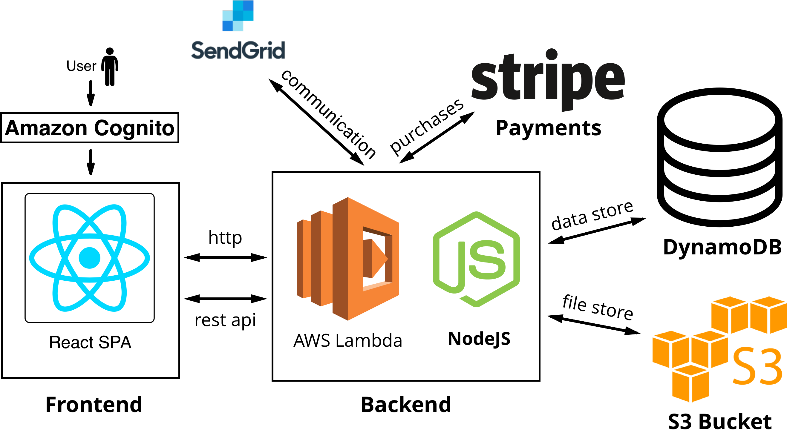

# Ladder: Helping Entrepreneurs Climb Towards Success

Being an entrepreneur involves thinking of innovative ideas that will impact the world in a meaningful way. All it takes is one good idea to change the world. However, no matter how well thought out an idea is, struggles arise when trying to sell a business proposition with no previous client base or audience.

Marketing a product or service is not a simple task, nor is it a low-cost undertaking. In order to solve these problems, Ladder is an application we’ve developed to solve exposure issues for small businesses and entrepreneurs. It is common for small entrepreneurs such as freelancers to have a small or non-existent marketing budget. Many businesses will advertise their services using their social media followings which has no direct connection to the purchasing of their services.

___[Read the full report here](report/ladder.pdf)___

## Built With

### Frontend
The front-end is a single page react application served statically from an S3 bucket

### Backend
The back-end is a collection of AWS lambda functions written in NodeJS. Authentication is a necessary component for the application which is handled by AWS Cognito. The main application state is stored in DynamoDB. However, images and other binary files are stored in a separate S3 bucket. Another APIs like Stripe and SendGrid are used to implement other requirements of the application.

